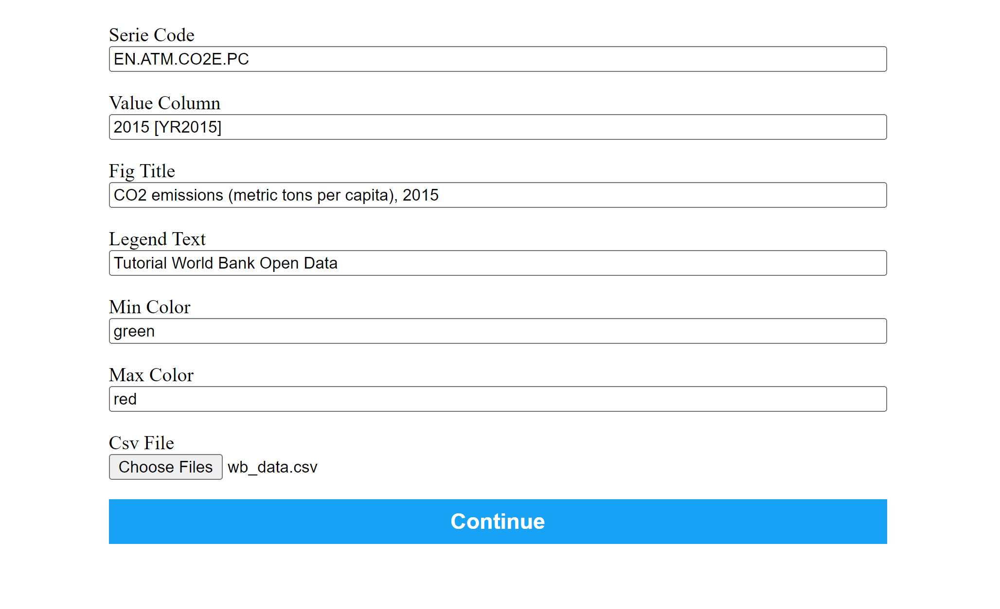

# World Bank Data Visualization Tool

## Installation

To run this World Bank Data Visualization Tool, you need to install `crosscompute`. Use the following command to install:

```bash
pip install crosscompute
```

Usage

1. Clone this repository to your local machine.

2. Navigate to the root of the repository in your terminal.

3. Run the following command to start the tool:

```bash
crosscompute
```

A web page will be opened, and you'll see something in the terminal like:

```
ASGI callable returned without completing response.
20240223-003625 INFO serving at http://127.0.0.1:7000
```

## Inputs and Outputs

### Inputs

Series Code: A unique code representing the type of data you want to visualize (e.g., population, GDP, surface area).
Value Column: The specific column in your spreadsheet containing data values corresponding to the series code (e.g., "2000 [YR2000]").
Figure Title: A title for your map, providing context for the visualized data.
Legend Text: A description for the legend on your map, aiding viewers in understanding the color scale.
Min and Max Colors: Choose the colors representing the minimum and maximum values on your map.
CSV File: Your data source, following a format similar to the World Bank Data spreadsheet.

Fill the fields or leave the predefined data



Use [this](./wb_data.csv) dataset to test the tool.

> Data Format
The tool is flexible and can work with various spreadsheet formats. As an example, consider the World Bank Data format:

```plaintext
Country Name    Country Code    Series Name                              Series Code       2000 [YR2000]   2001 [YR2001]
United States    USA             Population, total                         SP.POP.TOTL       282162411       284968955
United States    USA             Population growth (annual %)              SP.POP.GROW       1.112768997     0.989741382
United States    USA             CO2 emissions (metric tons per capita)    EN.ATM.CO2E.PC    20.46979674     20.17153693
...
...
```

Feel free to adapt the series code and value column based on your data structure.

### Outputs

Generate Map: Click the "continue" button to create a customized, color-coded map.
Download: Once generated, a downloadable image link will be provided. Save the image for sharing or inclusion in your reports.


Feel free to experiment with different datasets and spreadsheet structures for your specific needs.
